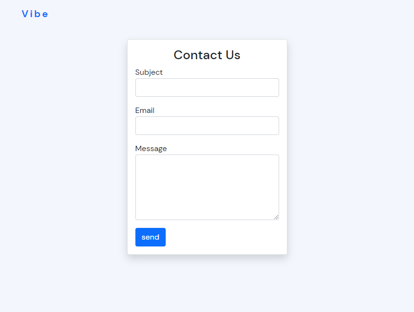
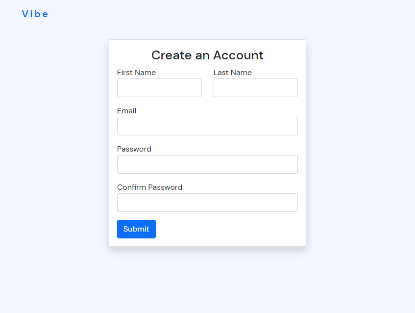
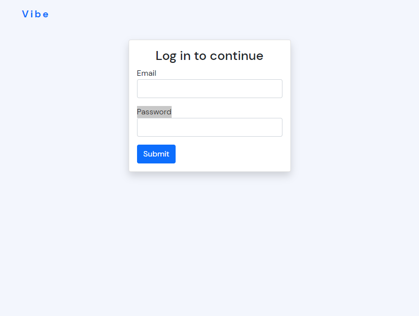
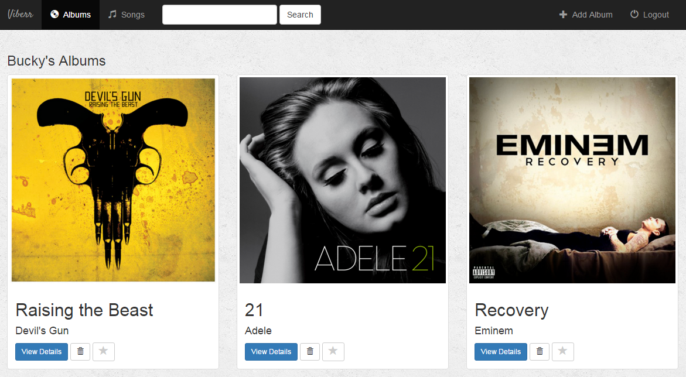
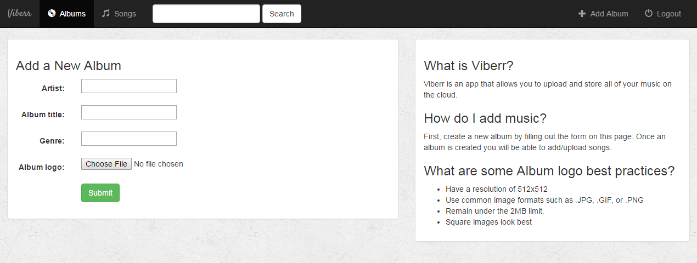
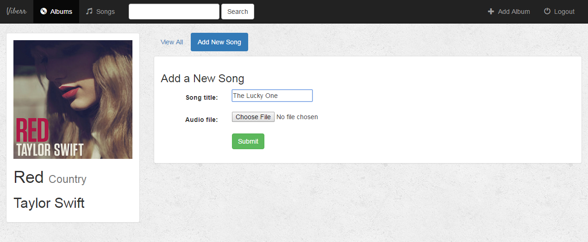
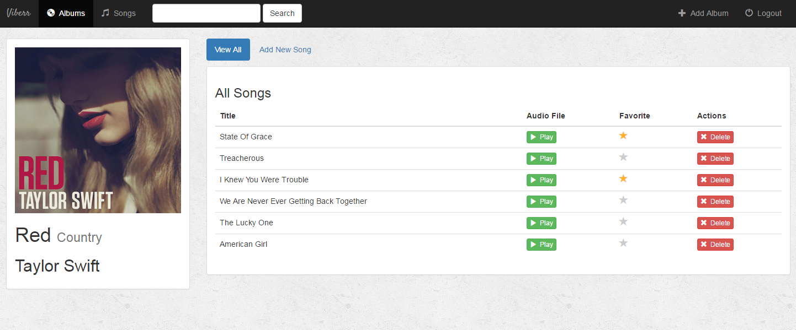
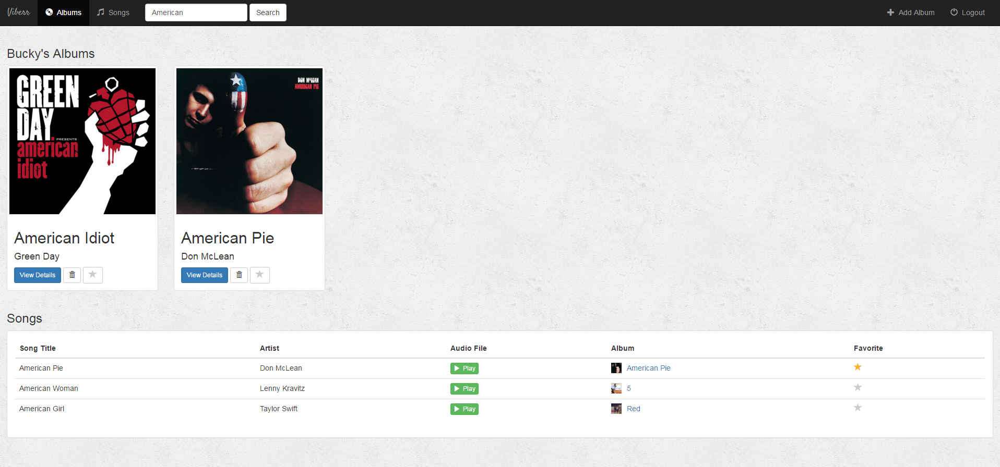

# Viberr Music App

Ideally music lovers should be able to easily access their favorite songs at anytime in an organized way. However in reality the songs are usually scattered in different folders on the user’s different devices. This leads to wastage of time when looking for a favorite song or even proofs impossible if all the storage devices are not at hand. Viberr is a music web application that will be designed to help users store music albums and songs in the cloud and be able to access and listen anytime. The app will be optimized for viewing on different screen sizes to enhance user experience. It will also help users easily share music and discover the most listened to songs, mark favorites and also be able to download songs or entire albums.

## Table of contents

- [Viberr Music App](#viberr-music-app)
  - [Table of contents](#table-of-contents)
  - [Objectives](#objectives)
    - [Specific objectives](#specific-objectives)
  - [Users](#users)
  - [Technical Requirements](#technical-requirements)
  - [Functional Requirements](#functional-requirements)
    - [Users Module](#users-module)
    - [Albums Module](#albums-module)
    - [Songs Module](#songs-module)
  - [Software Design Description](#software-design-description)
    - [User Interface Design](#user-interface-design)
      - [Contact Page](#contact-page)
      - [Registration page](#registration-page)
      - [login Page](#login-page)
      - [Albums page](#albums-page)
      - [Adding an album](#adding-an-album)
      - [Adding songs](#adding-songs)
      - [All songs](#all-songs)
      - [Searching](#searching)
    - [Database Design](#database-design)
      - [User Table](#user-table)
      - [Album Table](#album-table)
      - [song Table](#song-table)

## Objectives

The major objective of this project is to develop a music app that enhances a user’s music experience.

### Specific objectives

1. To create an albums management system that will allow users to create albums, delete or mark them as favorite.
2. To create a Songs management system that will allow users to add songs to albums, delete them or mark as favorite.
3. To create a users management system that will allow users to create accounts, login, view or edit their profiles.

## Users

1. Guest - This user will be able to view the landing page of the system as well as send feedback.
2. Authenticated user – Will be able to manage their albums and songs as well as shared music.
3. Staff – Will be able to view users, albums and songs reports.

## Technical Requirements

The application will be build on the following tecnologies:

- HTML, CSS , JavaScript
- Bootstrap
- PHP
- MySQL
- Apache web server

## Functional Requirements

### Users Module

- login
- Register
- view profile
- Reset password

### Albums Module

- create album
- edit album
- delete album
- view album songs
- Mark/unmark as favorite

### Songs Module

- add a new song
- Mark/unmark song as favorite
- Delete song

## Software Design Description

### User Interface Design

#### Contact Page

Guest user will be able to send feedback to the system admin without logging in.

#### Registration page

A user will be required to create an account before uploading or managing their music.

#### login Page

After Registration a user will be able to login by providing their email and password.

#### Albums page

The albums will list all the albums and will be the first page after login.

#### Adding an album

When adding an album cover logo, it's best to have a resolution of at least 512x512 and to use common image formats such as JPG, JPEG, or PNG.

#### Adding songs

After adding an album songs can be added to the album.

#### All songs

Once songs are the added to the album, one will be to play them, mark/unmark as favorite and can also delete.

#### Searching

One will be able to search for music using the search feature that will be placed at the top of every page. Any relevant albums will appear at the top of the results page, and the results for individual songs will appear below.

### Database Design

#### User Table

| Field name    | Data Type           | Length |
| ------------- | ------------------- | ------ |
| id            | bigint unsigned(PK) | 20     |
| first_name    | tinytext            | 256    |
| last_name     | tinytext            | 256    |
| email         | tinytext            | 256    |
| password      | tinytext            | 256    |
| is_staff      | boolean             | 1      |
| is_superadmin | boolean             | 1      |
| last_updated  | datetime            | 1      |

#### Album Table

| Field name   | Data Type           | Length |
| ------------ | ------------------- | ------ |
| id           | bigint unsigned(PK) | 20     |
| album_name   | tinytext            | 256    |
| artist       | tinytext            | 256    |
| genre        | tinytext            | 256    |
| album_logo   | tinytext            | 256    |
| is_favorite  | boolean             | 1      |
| user         | bigint unsigned(FK) | 20     |
| last_updated | timestamp           | 1      |

#### song Table

| Field name   | Data Type           | Length |
| ------------ | ------------------- | ------ |
| id           | bigint unsigned(PK) | 20     |
| song_title   | tinytext            | 256    |
| audio_file   | tinytext            | 256    |
| is_favorite  | boolean             | 1      |
| album        | bigint unsigned(FK) | 20     |
| last_updated | timestamp           | 1      |

#### Feedback Table

| Field name   | Data Type           | Length |
| ------------ | ------------------- | ------ |
| id           | bigint unsigned(PK) | 20     |
| subject      | tinytext            | 256    |
| body         | text                | 60000    |
| is_read      | boolean             | 1      |
| is_replied   | boolean             | 1      |
| date_sent    | timestamp           | 1      |
